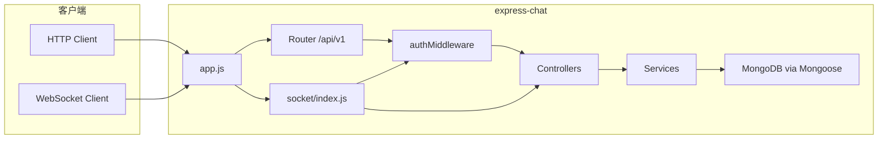

# express-chat 技术架构与接口说明

本文描述服务端分层、运行时依赖、实时通道约定，以及 HTTP / WebSocket 接口清单（与当前代码一致）。

---

## 1. 概述

**express-chat** 是一个基于 **Node.js + Express** 的即时通讯后端：提供用户注册登录、好友与群组、会话与历史消息等 **REST API**，并通过 **WebSocket（express-ws）** 推送私聊/群聊消息及好友在线状态。

- **HTTP 业务前缀**：`/api/v1`
- **JWT**：`Authorization: Bearer <token>`（业务接口）
- **MongoDB**：数据持久化（Mongoose）

---

## 2. 技术栈

| 类别 | 技术 |
|------|------|
| 运行时 | Node.js |
| Web 框架 | Express 4.x |
| 实时 | express-ws（WebSocket），项目依赖中含 socket.io 但未在 `app.js` 主路径挂载 |
| 数据库 | MongoDB + Mongoose 8.x |
| 鉴权 | jsonwebtoken，密码 bcryptjs |
| 校验 | express-validator |
| 配置 | dotenv-flow（按 `NODE_ENV` 加载 `.env.*`） |

---

## 3. 系统架构

### 3.1 分层结构

```
客户端
   │
   ├─ HTTP  ──► Express 路由 (router/*)
   │              ├─ 校验 (middleware/validation)
   │              ├─ 鉴权 (middleware/authMiddleware)
   │              └─ 控制器 (controller/*) ──► 服务层 (services/*) ──► 模型 (model/*) ──► MongoDB
   │
   └─ WebSocket ──► /socket/message
                     ├─ socketJwtMiddleware（Query 携带 Token）
                     └─ messageController（收发、广播）
```

### 3.2 模块职责（简要）

| 目录 | 职责 |
|------|------|
| `app.js` | 应用入口：中间件、路由挂载、`/health` `/ready`、WebSocket 初始化 |
| `router/` | 路由注册，URL 与控制器绑定 |
| `controller/` | 请求解析、调用 service、统一响应 |
| `services/` | 业务逻辑、事务、聚合查询 |
| `model/` | Mongoose Schema 与连接（`model/index.js` 内 `mongoose.connect`） |
| `middleware/` | JWT 校验、参数校验、统一 `handleSuccess` / `handleError` |
| `socket/` | WebSocket 连接表、心跳、与消息控制器协作 |
| `utils/` | 密码、JWT 辅助、生成 userId 等 |

### 3.3 核心数据流

1. **注册 / 登录**：写入或校验用户后，登录接口签发 JWT（载荷含 `id`（Mongo `_id`）、`userId`、`username` 等）。
2. **HTTP 拉取**：会话列表、消息分页、好友/群组等经 REST 查询。
3. **实时消息**：客户端连接 `ws://<host>/socket/message`，通过 Query 传递 `Authorization=Bearer+<token>`；服务端校验后，将连接与用户 `id` 关联；私聊仅允许向 **好友** 发送（服务层校验 `User.friends`）。

### 3.4 架构示意（Mermaid）



---

## 4. 统一响应格式

全局中间件 `middleware/responseMiddleware` 为 `res` 挂载：

- **成功**：`res.handleSuccess(data, message)`  
  - HTTP 状态码：**200**  
  - Body：`{ "code": 1, "message": "<可选>", "data": <载荷> }`

- **失败（业务）**：`res.handleError(message, data, statusCode)`  
  - 默认 HTTP 状态码：**400**（可通过第三参传入 404、409 等 4xx/5xx）  
  - Body：`{ "code": 0, "message": "<错误说明>", "data": ... }`

- **未授权（JWT）**：部分路由使用 `res.sendStatus(401)`，无上述 JSON 包装。

- **登录/注册限流**：触发时 HTTP **429**，Body 同为 `{ "code": 0, "message": "…", "data": null }`（见 `middleware/rateLimitAuth.js`）。

- **全局安全头**：使用 `helmet`（已关闭 CSP，避免影响根路径静态页）。

---

## 5. 鉴权说明

### 5.1 HTTP

- Header：`Authorization: Bearer <JWT>`
- 密钥：环境变量 `PASSWORD_SECRET`
- Token 载荷（登录时签发，具体以 `services/userService.login` 为准）：包含 `id`（用户 MongoDB `_id`，字符串形式）、`userId`、`username` 等。

### 5.2 WebSocket

Token 与 HTTP 使用同一 JWT，**优先级**（`middleware/authMiddleware` 内 `socketJwtMiddleware`）：

1. HTTP Header：`Authorization: Bearer <JWT>`（推荐服务端 / 原生客户端，避免 Token 进 URL）
2. Query：`Authorization=Bearer%20<JWT>`（与浏览器旧实现兼容）
3. Query：`token=<JWT>`（裸 JWT）

若 **以上均未提供 Token**，连接仍会建立，须在 **`WS_AUTH_TIMEOUT_MS`（默认 15000ms）内**发送**首包鉴权** JSON（可多次重试直至成功或超时）：

```json
{ "type": "auth", "token": "<JWT>" }
```

或：

```json
{ "type": "auth", "authorization": "Bearer <JWT>" }
```

鉴权成功后服务端推送 `type: auth_success`（见 §8.2），再按普通聊天收发包。

Header/Query 已带 Token 时行为与旧版一致，**无需**再发 `auth`。

校验失败时连接关闭，关闭码 **4001**；首包鉴权超时关闭码 **4001**（reason `Auth timeout`）。单用户连接数超过上限时关闭码 **4008**。

---

## 6. 运维与健康检查

| 路径 | 说明 |
|------|------|
| `GET /health` | **存活探针**：进程可响应即 **200**，不检查数据库。 |
| `GET /ready` | **就绪探针**：MongoDB 连接成功（`readyState === 1`）为 **200**，否则 **503**。 |

### 6.1 环境变量（常见）

| 变量 | 用途 |
|------|------|
| `NODE_ENV` | development / production，影响 dotenv-flow 加载文件 |
| `PORT` | HTTP 监听端口，默认 `3001` |
| `BASE_MONGO_URL` | MongoDB 连接串 |
| `PASSWORD_SECRET` | JWT 签名密钥 |
| `TRUST_PROXY` | 设为 `1` 时启用 `trust proxy`（置于 Nginx/Ingress 后时限流按真实 IP 生效） |
| `WS_MAX_MSG_PER_MIN` | 单条 WebSocket 连接每分钟最多处理多少条入站消息，默认 `120` |
| `WS_MAX_CONN_PER_USER` | 同一用户（`user.id`）最多允许多少条并发 WS，默认 `10` |
| `WS_MAX_CONTENT_LENGTH` | 单条聊天文本 `content` 最大字符数，默认 `8000` |
| `WS_AUTH_TIMEOUT_MS` | 未带 URL/Header Token 时，允许多久内完成首包鉴权，默认 `15000`（毫秒，最小约 `3000`） |

---

## 7. REST API 说明

**Base URL**：`http(s)://<host>:<port>/api/v1`

下列路径中，标注「需登录」的接口须在 Header 携带 `Authorization: Bearer <token>`。

### 7.1 用户与认证

| 方法 | 路径 | 需登录 | 说明 |
|------|------|--------|------|
| POST | `/auth/register` | 否 | 注册 |
| POST | `/auth/login` | 否 | 登录，返回 `token` |
| GET | `/user/userinfo` | 是 | 当前用户信息 |
| GET | `/user/getFriendList` | 是 | 好友列表分页 |
| GET | `/user/setUserStatus` | 是 | 更新在线状态（见下表 Query） |

**POST `/auth/register`**

- Body（JSON）：`username`（必填）、`email`（邮箱）、`password`（≥6 位）
- **限流**：约每 IP **10 次 / 小时**，超出返回 **429**。

**POST `/auth/login`**

- Body（JSON）：`username`、`password`（≥6 位）
- 成功 `data` 中含 `token`
- **限流**：约每 IP **30 次 / 15 分钟**，超出返回 **429**。

**GET `/user/getFriendList`**

- Query：`page`（默认 1）、`limit`（默认 10）

**GET `/user/setUserStatus`**

- 控制器调用 `changeUserStatus(req.user.id, req.status)`。若接入层未把状态挂到 `req.status`，请在前端或网关中与实现保持一致；通常期望 **Query**：`status=online` 或 `status=offline`（若与代码不一致需改控制器为 `req.query.status`）。

---

### 7.2 好友（路由前缀拼写为 `firend`，与代码一致）

| 方法 | 路径 | 需登录 | Body / Query |
|------|------|--------|----------------|
| POST | `/firend/send` | 是 | Body：`friendId`（对方 userId 或业务约定 ID，与服务实现一致） |
| POST | `/firend/accept` | 是 | Body：`friendId` |
| POST | `/firend/reject` | 是 | Body：`friendId` |
| GET | `/firend/requests` | 是 | Query：`page`（默认 1）、`limit`（默认 10） |

---

### 7.3 群组

| 方法 | 路径 | 需登录 | 参数 |
|------|------|--------|------|
| POST | `/group/create` | 是 | Body：`name`（必填），`avatar`（可选） |
| GET | `/group/info` | 是 | Query：`groupId` |
| POST | `/group/addMember` | 是 | Body：`groupId`、`memberId` |
| POST | `/group/removeMember` | 是 | Body：`groupId`、`memberId` |
| GET | `/group/joined` | 是 | 无额外参数 |
| GET | `/group/setGroupAdmin` | 是 | Body：`groupId`、`setUser`（被设为管理员的用户 ID） |

> 说明：`/group/setGroupAdmin` 在路由上注册为 **GET**，但校验与控制器使用 **Body**，建议后续改为 **POST** 以符合语义。

---

### 7.4 会话

| 方法 | 路径 | 需登录 | 参数 |
|------|------|--------|------|
| GET | `/conversation/getUserConversationList` | 是 | Query：`type`（可选，默认空）、`page`（默认 1）、`limit`（默认 10） |
| POST | `/conversation/markAsRead` | 是 | Body：`conversationId` |
| GET | `/conversation/getConversationId` | 是 | Query：`type`、`id`（按会话类型查找会话 ID） |

---

### 7.5 消息（HTTP）

| 方法 | 路径 | 需登录 | 参数 |
|------|------|--------|------|
| GET | `/message/getConversationMessageList` | 是 | Query：`conversationId`（必填）、`limit`（默认 10）、`lastId`（可选，分页游标） |

---

### 7.6 测试接口

| 方法 | 路径 | 需登录 | 说明 |
|------|------|--------|------|
| POST | `/test/add` | 否 | 透传 `req.body` 至测试服务，仅用于开发/联调 |

---

## 8. WebSocket 协议说明

### 8.1 连接

- **路径**：`/socket/message`
- **鉴权**：见 **§5.2**（Header / Query 立即鉴权，或首包 `type: auth` 延迟鉴权）
- **入站校验**：载荷由 `utils/wsMessageValidation.js` 校验 `conversationType`、`content`、`contentType` 等；单帧体积上限约 **64KB**（UTF-8）
- **频控**：每条连接 **每分钟** 入站消息数上限见 `WS_MAX_MSG_PER_MIN`，超出时服务端推送 `message_error`，文案为「发送过于频繁…」

### 8.2 服务端推送消息封装

JSON 外层结构：

```json
{
  "type": "<见下表>",
  "data": { }
}
```

`type` 与 `enum/message.js` 中 `MESSAGE_TYPE` 对应，主要包括：

| type 值 | 含义 |
|---------|------|
| `user_message` | 私聊消息 |
| `group_message` | 群聊消息 |
| `friend_status_notification` | 好友上/下线 |
| `message_success` | 发送成功回执（发给发送方） |
| `message_error` | 发送失败（`data.error` 为说明） |
| `auth_success` | 首包鉴权成功（`data` 含 `id`、`userId`、`username` 等 JWT 载荷字段） |

### 8.3 客户端发送（JSON 字符串）

- `conversationType`：**必填**，`private` | `group`
- `content`：**必填**非空字符串，长度不超过 `WS_MAX_CONTENT_LENGTH`
- `contentType`：可选，默认 `text`；允许 `text` | `image` | `file`

**私聊**额外字段：

- `recipientId`：接收方（MongoDB `_id` 或业务 `userId`，由服务解析）

**群聊**额外字段：

- `groupId`：群组 ID

私聊需满足 **双方已为好友**（`User.friends`），否则服务端返回 `message_error`。

### 8.4 心跳与异步

- 服务端定时 **ping**，依赖客户端 **pong**；超时未响应的连接会被 **terminate**
- `message` 回调内业务为异步，已在 `socket/index.js` 中 **`.catch`**，避免未处理的 Promise 拒绝

---

## 9. 数据模型（概念）

主要集合/模型包括：用户（含 `friends`、`groups`）、好友请求（Friend）、群组（Group）、会话（Conversation）、消息（Message）、会话已读（ConversationRead）等，字段以 `model/` 下 Schema 为准。

---

## 10. 已知实现注意点（维护时参考）

- 业务失败默认 **HTTP 400**，仍可通过 body 中 `code: 0` 判断；限流为 **429**。
- 好友相关路径名为 **`firend`**，与英文 `friend` 不一致，对接文档与客户端需沿用现路径或统一重构。
- `GET /group/setGroupAdmin` 使用 Body，语义上更适合 POST。
- `setUserStatus` 若需从 Query 读状态，应确认使用 `req.query.status` 并与文档对齐。
- WebSocket：浏览器若只能用 Query 传 Token，请注意代理/日志泄露风险；可使用**首包鉴权**（连接不带 Token，建立后发送 `{ "type":"auth","token":"..." }`）避免 Token 出现在 URL。

---

*文档版本与仓库代码同步维护；修改路由或响应格式时请更新本文。*
