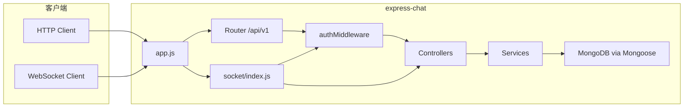

# express-chat 技术架构与接口说明

本文描述服务端分层、运行时依赖、实时通道约定，以及 HTTP / WebSocket 接口清单（与当前代码一致）。

---

## 1. 概述

**express-chat** 是一个基于 **Node.js + Express** 的即时通讯后端：提供用户注册登录、资料维护、好友与群组、会话与历史消息等 **REST API**，并通过 **WebSocket（express-ws）** 推送私聊/群聊消息、好友关系事件及在线状态。服务端还提供可配置的实验性私聊端到端加密协商与密文存储能力。

- **HTTP 业务前缀**：`/api/v1`
- **JWT**：`Authorization: Bearer <token>`（业务接口）
- **MongoDB**：数据持久化（Mongoose）

---

## 2. 技术栈

| 类别 | 技术 |
|------|------|
| 运行时 | Node.js |
| Web 框架 | Express 4.x |
| 实时 | express-ws（WebSocket），项目依赖中含 socket.io 但未在 `app.js` 主路径挂载 |
| 数据库 | MongoDB + Mongoose 8.x |
| 鉴权 | jsonwebtoken，密码 bcryptjs |
| 校验 | express-validator |
| 配置 | dotenv-flow（按 `NODE_ENV` 加载 `.env.*`） |
| 端到端加密 | NaCl Box 协议字段与密文透传；实际加解密由客户端完成 |

---

## 3. 系统架构

### 3.1 分层结构

```
客户端
   │
   ├─ HTTP  ──► Express 路由 (router/*)
   │              ├─ 校验 (middleware/validation)
   │              ├─ 鉴权 (middleware/authMiddleware)
   │              └─ 控制器 (controller/*) ──► 服务层 (services/*) ──► 模型 (model/*) ──► MongoDB
   │
   └─ WebSocket ──► /socket/message
                     ├─ socketJwtMiddleware（Query 携带 Token）
                     └─ messageController（收发、广播）
```

### 3.2 模块职责（简要）

| 目录 | 职责 |
|------|------|
| `app.js` | 应用入口：中间件、路由挂载、`/health` `/ready`、WebSocket 初始化 |
| `router/` | 路由注册，URL 与控制器绑定 |
| `controller/` | 请求解析、调用 service、统一响应 |
| `services/` | 业务逻辑、事务、聚合查询 |
| `model/` | Mongoose Schema 与连接（`model/index.js` 内 `mongoose.connect`） |
| `middleware/` | JWT 校验、参数校验、统一 `handleSuccess` / `handleError` |
| `socket/` | WebSocket 连接表、心跳、与消息控制器协作 |
| `utils/` | 密码、JWT 辅助、生成 userId 等 |

### 3.3 核心数据流

1. **注册 / 登录**：写入或校验用户后，登录接口签发 JWT（载荷含 `id`（Mongo `_id`）、`userId`、`username` 等）。
2. **HTTP 拉取**：会话列表、消息分页、好友/群组等经 REST 查询。
3. **实时消息**：客户端连接 `ws://<host>/socket/message`，通过 Query 传递 `Authorization=Bearer+<token>`；服务端校验后，将连接与用户 `id` 关联；私聊仅允许向 **好友** 发送（服务层校验 `User.friends`）。

### 3.4 架构示意（Mermaid）



---

## 4. 统一响应格式

全局中间件 `middleware/responseMiddleware` 为 `res` 挂载：

- **成功**：`res.handleSuccess(data, message)`  
  - HTTP 状态码：**200**  
  - Body：`{ "code": 1, "message": "<可选>", "data": <载荷> }`

- **失败（业务）**：`res.handleError(message, data, statusCode)`  
  - 默认 HTTP 状态码：**400**（可通过第三参传入 404、409 等 4xx/5xx）  
  - Body：`{ "code": 0, "message": "<错误说明>", "data": ... }`

- **未授权（JWT）**：部分路由使用 `res.sendStatus(401)`，无上述 JSON 包装。

- **登录/注册限流**：触发时 HTTP **429**，Body 同为 `{ "code": 0, "message": "…", "data": null }`（见 `middleware/rateLimitAuth.js`）。

- **全局安全头**：使用 `helmet`（已关闭 CSP，避免影响根路径静态页）。

---

## 5. 鉴权说明

### 5.1 HTTP

- Header：`Authorization: Bearer <JWT>`
- 密钥：环境变量 `PASSWORD_SECRET`
- Token 载荷（登录时签发，具体以 `services/userService.login` 为准）：包含 `id`（用户 MongoDB `_id`，字符串形式）、`userId`、`username` 等。

### 5.2 WebSocket

Token 与 HTTP 使用同一 JWT，**优先级**（`middleware/authMiddleware` 内 `socketJwtMiddleware`）：

1. HTTP Header：`Authorization: Bearer <JWT>`（推荐服务端 / 原生客户端，避免 Token 进 URL）
2. Query：`Authorization=Bearer%20<JWT>`（与浏览器旧实现兼容）
3. Query：`token=<JWT>`（裸 JWT）

若 **以上均未提供 Token**，连接仍会建立，须在 **`WS_AUTH_TIMEOUT_MS`（默认 15000ms）内**发送**首包鉴权** JSON（可多次重试直至成功或超时）：

```json
{ "type": "auth", "token": "<JWT>" }
```

或：

```json
{ "type": "auth", "authorization": "Bearer <JWT>" }
```

鉴权成功后服务端推送 `type: auth_success`（见 §8.2），再按普通聊天收发包。

Header/Query 已带 Token 时行为与旧版一致，**无需**再发 `auth`。

校验失败时连接关闭，关闭码 **4001**；首包鉴权超时关闭码 **4001**（reason `Auth timeout`）。单用户连接数超过上限时关闭码 **4008**。

---

## 6. 运维与健康检查

| 路径 | 说明 |
|------|------|
| `GET /health` | **存活探针**：进程可响应即 **200**，不检查数据库。 |
| `GET /ready` | **就绪探针**：MongoDB 连接成功（`readyState === 1`）为 **200**，否则 **503**。 |

### 6.1 环境变量（常见）

| 变量 | 用途 |
|------|------|
| `NODE_ENV` | development / production，影响 dotenv-flow 加载文件 |
| `PORT` | HTTP 监听端口，默认 `3001` |
| `BASE_MONGO_URL` | MongoDB 连接串 |
| `PASSWORD_SECRET` | JWT 签名密钥 |
| `TRUST_PROXY` | 设为 `1` 时启用 `trust proxy`（置于 Nginx/Ingress 后时限流按真实 IP 生效） |
| `WS_MAX_MSG_PER_MIN` | 单条 WebSocket 连接每分钟最多处理多少条入站消息，默认 `120` |
| `WS_MAX_CONN_PER_USER` | 同一用户（`user.id`）最多允许多少条并发 WS，默认 `10` |
| `WS_MAX_CONTENT_LENGTH` | 单条聊天文本 `content` 最大字符数，默认 `8000` |
| `WS_AUTH_TIMEOUT_MS` | 未带 URL/Header Token 时，允许多久内完成首包鉴权，默认 `15000`（毫秒，最小约 `3000`） |
| `E2EE_ENABLED` | 是否开放私聊端到端加密接口；仅字符串 `true` 表示开启，默认关闭 |
| `MESSAGE_RECALL_WINDOW_SECONDS` | 发送者可撤回消息的时间窗口，默认 `120` 秒 |
| `UPLOAD_DRIVER` | 图片存储驱动：`local`（默认）或 `oss` |
| `UPLOAD_MAX_IMAGE_MB` | 单张图片大小上限，默认 `10` MB |
| `UPLOAD_MAX_FILE_MB` | 单个普通文件大小上限，默认 `25` MB |
| `UPLOAD_MAX_AUDIO_MB` | 单条语音文件大小上限，默认 `15` MB |
| `UPLOAD_LOCAL_DIR` | 本地存储目录；默认项目根目录下 `uploads/` |
| `PUBLIC_BASE_URL` | 本地存储返回图片 URL 时使用的服务端公开地址 |
| `OSS_REGION` / `OSS_BUCKET` | 阿里云 OSS 地域与 Bucket |
| `OSS_ACCESS_KEY_ID` / `OSS_ACCESS_KEY_SECRET` | 阿里云 OSS 访问凭据，禁止提交到仓库 |
| `OSS_ENDPOINT` | 自定义 OSS Endpoint，可选 |
| `OSS_PUBLIC_BASE_URL` | OSS/CDN 对外访问前缀，可选 |

### 6.2 MongoDB 事务要求

删除好友等操作使用 MongoDB 事务，因此 MongoDB 必须运行在 **副本集成员或 mongos** 上。仅启动普通单机 `mongod` 会出现 `Transaction numbers are only allowed on a replica set member or mongos`。本地开发也应初始化单节点副本集，并在 `BASE_MONGO_URL` 中配置对应的 `replicaSet` 参数。

---

## 7. REST API 说明

**Base URL**：`http(s)://<host>:<port>/api/v1`

下列路径中，标注「需登录」的接口须在 Header 携带 `Authorization: Bearer <token>`。

### 7.1 用户与认证

| 方法 | 路径 | 需登录 | 说明 |
|------|------|--------|------|
| POST | `/auth/register` | 否 | 注册 |
| POST | `/auth/login` | 否 | 登录，返回 `token` 与 `sessionId` |
| POST | `/auth/logout` | 是 | 撤销当前设备会话 |
| GET | `/auth/sessions` | 是 | 获取有效登录设备列表 |
| DELETE | `/auth/sessions/:sessionId` | 是 | 撤销指定设备会话 |
| POST | `/auth/sessions/revoke-others` | 是 | 撤销除当前设备外的全部会话 |
| PUT | `/auth/password` | 是 | 验证旧密码并修改密码，撤销其他设备会话 |
| GET | `/user/userinfo` | 是 | 当前用户信息 |
| PUT | `/user/profile` | 是 | 修改用户名、邮箱或头像；返回最新用户资料和新 `token` |
| GET | `/user/notification-settings` | 是 | 获取消息通知偏好 |
| PUT | `/user/notification-settings` | 是 | 更新消息通知偏好 |
| GET | `/user/getFriendList` | 是 | 好友列表分页 |
| GET | `/user/setUserStatus` | 是 | 更新在线状态（见下表 Query） |

**POST `/auth/register`**

- Body（JSON）：`username`（必填）、`email`（邮箱）、`password`（≥6 位）
- **限流**：约每 IP **10 次 / 小时**，超出返回 **429**。

**POST `/auth/login`**

- Body（JSON）：`username`、`password`（≥6 位），可选 `deviceName`、`platform`
- 成功 `data` 中含 `token`、`sessionId`
- **限流**：约每 IP **30 次 / 15 分钟**，超出返回 **429**。

登录成功后，服务端会在 `Session` 集合记录设备名称、平台、浏览器、IP、最近活跃时间和过期时间，并把随机 `sessionId` 写入 JWT 的 `sid` 字段。HTTP 与 WebSocket 鉴权都会检查该会话；撤销后 REST 请求立即返回 `401`，对应实时连接收到 `session_revoked`，随后由服务端以 `4002` 关闭。升级前签发的不含 `sid` 的 24 小时令牌会兼容到自然过期。

**PUT `/auth/password`**

- Body（JSON）：`currentPassword`（当前密码）、`newPassword`（8～128 位）。
- 当前密码校验成功后更新密码哈希，保留当前设备会话，撤销并断开其他设备会话。

**GET `/user/getFriendList`**

- Query：`page`（默认 1）、`limit`（默认 10）

**PUT `/user/profile`**

- Body（JSON）：可传 `username`、`email`、`avatar`，用户名和邮箱会进行唯一性校验。
- 成功 `data`：`{ "user": <最新用户>, "token": "<新 JWT>" }`。
- 修改用户名后旧 JWT 中仍是旧资料，客户端应立即保存接口返回的新 `token`。

**PUT `/user/notification-settings`**

- Body（JSON）可选字段：`messageSound`、`friendRequestSound`、`showMessagePreview`，均为布尔值。
- 设置保存在账号资料中并跨设备同步；客户端本地缓存用于 WebSocket 消息到达时即时判断，无需额外请求。

**GET `/user/setUserStatus`**

- 控制器调用 `changeUserStatus(req.user.id, req.status)`。若接入层未把状态挂到 `req.status`，请在前端或网关中与实现保持一致；通常期望 **Query**：`status=online` 或 `status=offline`（若与代码不一致需改控制器为 `req.query.status`）。

---

### 7.2 好友（路由前缀拼写为 `firend`，与代码一致）

| 方法 | 路径 | 需登录 | Body / Query |
|------|------|--------|----------------|
| POST | `/firend/send` | 是 | Body：`friendId`（对方 userId 或业务约定 ID，与服务实现一致） |
| POST | `/firend/accept` | 是 | Body：`friendId` |
| POST | `/firend/reject` | 是 | Body：`friendId` |
| POST | `/firend/remove` | 是 | Body：`friendId`（对方 MongoDB `_id`）；双向解除好友，保留历史消息 |
| GET | `/firend/requests` | 是 | Query：`page`（默认 1）、`limit`（默认 10） |
| POST | `/firend/block` | 是 | Body：`friendId`（对方 MongoDB `_id`）；拉黑并解除好友 |
| POST | `/firend/unblock` | 是 | Body：`friendId`；解除屏蔽，不自动恢复好友 |
| GET | `/firend/blocked` | 是 | 获取本人黑名单 |

好友申请、同意、拒绝和删除成功后会通过 WebSocket 向相关用户推送事件，客户端可据此刷新申请提示、TabBar 徽标和通讯录，无需轮询。

拉黑会双向解除好友关系并删除双方未处理的好友申请。任意一方将对方加入黑名单后，服务端都会拒绝双方的新好友申请和私聊消息；黑名单字段不会出现在普通用户资料或好友列表响应中。

---

### 7.3 群组

| 方法 | 路径 | 需登录 | 参数 |
|------|------|--------|------|
| POST | `/group/create` | 是 | Body：`name`（必填），`avatar`（可选） |
| GET | `/group/info` | 是 | Query：`groupId` |
| POST | `/group/addMember` | 是 | Body：`groupId`、`memberId` |
| POST | `/group/removeMember` | 是 | Body：`groupId`、`memberId` |
| GET | `/group/joined` | 是 | 无额外参数 |
| POST | `/group/setGroupAdmin` | 是 | Body：`groupId`、`setUser`（被设为管理员的用户 ID） |
| POST | `/group/cancelGroupAdmin` | 是 | Body：`groupId`、`setUser`（被取消管理员的用户 ID） |
| POST | `/group/transferOwner` | 是 | Body：`groupId`、`newOwnerId`；仅群主可操作 |
| POST | `/group/announcement` | 是 | Body：`groupId`、`announcement`（最多 500 字）；群主或管理员可操作 |
| POST | `/group/dissolve` | 是 | Body：`groupId`；仅群主可操作，将永久删除群会话和群消息 |

权限约定：群主可设置或取消管理员、转让群主身份或解散群聊；群主和管理员可邀请、移除普通成员及修改群公告。成员调用 `removeMember` 并将 `memberId` 设为自己时表示退群；群主需先转让身份才能退出。公告和群主变化会向在线成员推送 `group_updated`，解散会推送 `group_dissolved`。群成员变化会同步到对应群会话，避免群资料与会话成员不一致。

---

### 7.4 会话

| 方法 | 路径 | 需登录 | 参数 |
|------|------|--------|------|
| GET | `/conversation/getUserConversationList` | 是 | Query：`type`（可选，默认空）、`page`（默认 1）、`limit`（默认 10） |
| POST | `/conversation/markAsRead` | 是 | Body：`conversationId` |
| GET | `/conversation/readStatus` | 是 | Query：`conversationId`；返回会话成员持久化的已读时间 |
| POST | `/conversation/clear` | 是 | Body：`conversationId`；仅清空当前用户视角的历史记录 |
| POST | `/conversation/preferences` | 是 | Body：`conversationId`，以及可选的 `pinned`、`muted` 布尔值；更新当前用户独立的会话偏好 |
| GET | `/conversation/getConversationId` | 是 | Query：`type`、`id`（按会话类型查找会话 ID） |

`/conversation/clear` 通过 `ConversationRead.clearedAt` 隐藏清空时间之前的消息，不会物理删除消息，也不会影响其他会话成员。置顶和免打扰同样按用户保存，不影响会话中的其他成员；会话列表优先返回置顶会话，并包含 `isPinned`、`pinnedAt`、`muted`、每项 `unreadCount` 及全局 `totalUnread`。未读统计排除自己的消息、已撤回消息、仅为自己删除的消息以及已读/已清空时间之前的消息。会话列表中的群聊项包含 `groupId`；加密消息摘要显示为“🔒 加密消息”，普通图片消息摘要显示为“[图片]”。

---

### 7.5 消息（HTTP）

| 方法 | 路径 | 需登录 | 参数 |
|------|------|--------|------|
| GET | `/message/getConversationMessageList` | 是 | Query：`conversationId`（必填）、`limit`（默认 10）、`lastId`（可选，分页游标） |
| POST | `/message/recall` | 是 | Body：`messageId`；仅发送者可在限定时间内撤回 |
| POST | `/message/deleteForMe` | 是 | Body：`messageId`；只对当前用户隐藏，不影响其他成员 |
| POST | `/message/reaction` | 是 | Body：`messageId`、`emoji`；添加或取消表情回应 |

消息支持 `replyTo` 引用同一会话内未撤回的消息。历史列表会返回引用消息的摘要字段；已撤回消息不再返回原正文，已被当前用户删除的消息不会出现在其历史列表中。

---

### 7.6 端到端加密（实验性，仅私聊）

| 方法 | 路径 | 需登录 | 参数 |
|------|------|--------|------|
| GET | `/e2ee/status` | 是 | Query：`peerId`（对方 MongoDB `_id`） |
| POST | `/e2ee/public-key` | 是 | Body：`publicKey`（Base64 公钥字符串） |
| GET | `/e2ee/key-backup` | 是 | 获取当前账号经过客户端加密的私钥备份 |
| PUT | `/e2ee/key-backup` | 是 | 上传加密备份：`ciphertext`、`nonce`、`salt`、`iterations`、`algorithm`、`publicKey` |
| POST | `/e2ee/key-reset` | 是 | 原密钥无法恢复时重置；关闭现有加密私聊，旧密文不可恢复 |
| POST | `/e2ee/conversation` | 是 | Body：`peerId`、`enabled`（布尔值） |

`GET /e2ee/status` 返回：

```json
{
  "enabled": true,
  "ownPublicKey": "<base64>",
  "peerPublicKey": "<base64>",
  "conversationId": "<id-or-null>",
  "encryptionMode": "plaintext"
}
```

- `enabled` 表示服务端全局开关，不等同于当前会话已经加密；会话状态以 `encryptionMode` 为准。
- 开启会话加密要求双方均已登记公钥且互为好友。双方都可以发起切换；公钥准备和模式变化会通过 WebSocket 实时同步，尚无双方确认流程。
- `E2EE_ENABLED=false` 时不能登记公钥或开启加密；已经处于 `e2ee` 模式的会话也不能继续发送，需重新开启全局配置或切回明文。

#### 跨设备密钥备份与恢复

`PUT /e2ee/key-backup` 请求示例：

```json
{
  "ciphertext": "<base64-encrypted-keypair>",
  "nonce": "<base64>",
  "salt": "<base64>",
  "iterations": 150000,
  "algorithm": "pbkdf2-sha256+nacl-secretbox-v1",
  "publicKey": "<base64>"
}
```

`GET /e2ee/key-backup` 在没有备份时返回 `{ "exists": false, "publicKey": "..." }`；存在备份时返回 `exists: true` 及上述密文参数和 `updatedAt`。

`POST /e2ee/key-reset` 仅用于原设备私钥和云端备份均已丢失的恢复场景。Body 需传新 `publicKey` 与固定确认值 `confirmation: "RESET_E2EE_KEY"`。调用后会替换账号公钥、清空旧备份，并将该用户当前所有 `e2ee` 私聊切回 `plaintext`；旧密文无法用新密钥解密。

推荐客户端流程：

1. 原设备使用用户设置的独立恢复密码，经 PBKDF2-SHA256（当前 150000 次）派生 32 字节密钥。
2. 使用 NaCl Secretbox 在客户端加密公私钥对，只上传密文、nonce、salt、迭代次数、算法名和公钥；恢复密码不得上传。
3. 新设备下载密文备份，要求用户输入恢复密码，并仅在本地解密。
4. 从恢复出的私钥重新计算公钥，同时校验备份公钥与账号 `e2eePublicKey`，一致后才写入本地存储。
5. 老账号如果已有公钥但尚无备份，必须回到仍持有私钥的原设备创建备份；新设备不得生成密钥覆盖旧公钥。

### 7.7 图片上传

| 方法 | 路径 | 需登录 | 参数 |
|------|------|--------|------|
| POST | `/upload/image` | 是 | `multipart/form-data`，文件字段名为 `file` |
| POST | `/upload/file` | 是 | `multipart/form-data`，文件字段名为 `file`；支持 PDF、文本、ZIP 与常用 Office 文档 |
| POST | `/upload/audio` | 是 | `multipart/form-data`，文件字段名为 `file`；支持 MP3、M4A、AAC、WAV、AMR、OGG |

- 支持 JPG、PNG、WebP、GIF；服务端同时校验 MIME 与文件头，默认最大 10MB。
- `UPLOAD_DRIVER=local` 时写入本地目录并通过 `/uploads/*` 公开访问。
- `UPLOAD_DRIVER=oss` 时上传到阿里云 OSS；建议生产环境配置 `OSS_PUBLIC_BASE_URL` 指向自定义域名或 CDN。
- 文件消息的 `content` 保存 JSON 元数据（`name`、`size`、`mimeType`、`url`），会话摘要统一显示为“[文件]”。文件和图片当前都不参与私聊 E2EE，加密会话中前端会禁用附件发送。
- 语音消息的 `content` 保存 JSON 元数据（`url`、`duration`、`size`、`mimeType`），会话摘要显示为“[语音]”。语音文件当前同样不参与私聊 E2EE。
- 成功返回 `{ "driver", "objectName", "url" }`，聊天消息将 `url` 作为 `content`，并使用 `contentType: "image"`。
- 当前图片文件本身不参与私聊 E2EE，因此前端在加密会话中暂时禁止发送图片。

### 7.8 测试接口

| 方法 | 路径 | 需登录 | 说明 |
|------|------|--------|------|
| POST | `/test/add` | 否 | 透传 `req.body` 至测试服务，仅用于开发/联调 |

---

## 8. WebSocket 协议说明

### 8.1 连接

- **路径**：`/socket/message`
- **鉴权**：见 **§5.2**（Header / Query 立即鉴权，或首包 `type: auth` 延迟鉴权）
- **入站校验**：载荷由 `utils/wsMessageValidation.js` 校验 `conversationType`、`content`、`contentType` 等；单帧体积上限约 **64KB**（UTF-8）
- **频控**：每条连接 **每分钟** 入站消息数上限见 `WS_MAX_MSG_PER_MIN`，超出时服务端推送 `message_error`，文案为「发送过于频繁…」

### 8.2 服务端推送消息封装

JSON 外层结构：

```json
{
  "type": "<见下表>",
  "data": { }
}
```

`type` 与 `enum/message.js` 中 `MESSAGE_TYPE` 对应，主要包括：

| type 值 | 含义 |
|---------|------|
| `user_message` | 私聊消息 |
| `group_message` | 群聊消息 |
| `friend_status_notification` | 好友上/下线 |
| `friend_request_received` | 收到新的好友申请 |
| `friend_request_accepted` | 好友申请被接受 |
| `friend_request_rejected` | 好友申请被拒绝 |
| `friend_removed` | 好友关系已被对方解除 |
| `e2ee_key_ready` | 好友已登记 E2EE 公钥；`data.userId` 为已就绪用户 |
| `e2ee_mode_changed` | 私聊加密模式变化；包含 `conversationId`、`encryptionMode`、`changedBy`、`members` |
| `message_recalled` | 消息撤回事件；包含 `messageId`、`conversationId`、`recalledAt`、`recalledBy` |
| `message_reaction` | 消息回应变化；包含 `messageId`、`conversationId`、完整 `reactions` 与本次操作状态 |
| `message_success` | 发送成功回执（发给发送方） |
| `message_error` | 发送失败（`data.error` 为说明） |
| `typing` | 对端正在输入的短暂状态；包含发送者和当前私聊会话或群组标识，不写入数据库 |
| `conversation_read` | 会话成员更新已读时间；包含 `conversationId`、`userId`、`readAt` |
| `auth_success` | 首包鉴权成功（`data` 含 `id`、`userId`、`username` 等 JWT 载荷字段） |

### 8.3 客户端发送（JSON 字符串）

- `conversationType`：**必填**，`private` | `group`
- `content`：**必填**非空字符串，长度不超过 `WS_MAX_CONTENT_LENGTH`
- `contentType`：可选，默认 `text`；允许 `text` | `image` | `file`
- `encrypted`：加密私聊传 `true`
- `nonce`：加密私聊必填，Base64 编码的随机数
- `encryptionAlgorithm`：当前前端使用 `nacl-box-v1`
- `clientMessageId`：客户端生成的单次消息编号，用于发送回执、失败重试和服务端幂等去重
- `replyTo`：可选，被引用消息的 MongoDB `_id`；必须属于当前会话且尚未撤回

**私聊**额外字段：

- `recipientId`：接收方（MongoDB `_id` 或业务 `userId`，由服务解析）

**群聊**额外字段：

- `groupId`：群组 ID

输入状态使用独立载荷 `{ "type": "typing", "conversationType": "private|group", "recipientId|groupId": "...", "active": true|false }`。服务端会再次验证私聊会话或群成员身份，只向目标在线成员转发；该状态不创建 Message，也不会保存历史。

私聊需满足 **双方已为好友**（`User.friends`），否则服务端返回 `message_error`。

当私聊会话的 `encryptionMode` 为 `e2ee` 时，服务端拒绝明文消息；为 `plaintext` 时拒绝标记为加密的消息。密文保存在 Message 的 `content` 字段中，服务端不持有客户端私钥，也不执行明文解密。

发送方会在 `message_success` 或 `message_error` 中收到相同的 `clientMessageId`。Message 对 `(sender, clientMessageId)` 建立唯一索引；客户端使用同一编号重试时，服务端返回已有消息，避免回执丢失造成重复入库。

### 8.4 心跳与异步

- 服务端定时 **ping**，依赖客户端 **pong**；超时未响应的连接会被 **terminate**
- `message` 回调内业务为异步，已在 `socket/index.js` 中 **`.catch`**，避免未处理的 Promise 拒绝

---

## 9. 数据模型（概念）

主要集合/模型包括：用户（含 `friends`、`groups`、`e2eePublicKey`）、好友请求（Friend）、群组（Group）、会话（Conversation，含 `encryptionMode`）、消息（Message，含 `replyTo`、`reactions`、`recalledAt`、`deletedFor`、`encrypted`、`nonce`、`encryptionAlgorithm`）、用户会话状态（ConversationRead，含 `clearedAt`、`pinnedAt`、`muted`）等，字段以 `model/` 下 Schema 为准。

### 9.1 端到端加密安全边界

当前实现是**实验性的私聊 E2EE**，不等同于 Signal 等成熟安全协议：

- 私钥默认保存在客户端本地；用户设置独立恢复密码后，可将由 PBKDF2-SHA256 与 NaCl Secretbox 加密的私钥备份保存到服务端，并在新设备本地恢复。服务端不保存恢复密码或明文私钥。
- 恢复密码无法由服务端找回；未创建备份，或忘记恢复密码且原设备不可用时，旧消息仍可能永久无法解密。
- 当前支持用户主动备份后在新设备恢复同一私钥，账号登录设备可以查看和撤销；但不支持自动多设备密钥同步、群聊加密、安全码或密钥指纹核验。
- 当前没有 Double Ratchet，因此不提供成熟协议级别的前向保密和入侵后恢复能力。
- 会话加密开关尚无双方确认机制；敏感业务上线前应补齐身份验证、密钥变更告警、恢复方案并进行专业密码学安全审计。

---

## 10. 已知实现注意点（维护时参考）

- 业务失败默认 **HTTP 400**，仍可通过 body 中 `code: 0` 判断；限流为 **429**。
- 好友相关路径名为 **`firend`**，与英文 `friend` 不一致，对接文档与客户端需沿用现路径或统一重构。
- `setUserStatus` 若需从 Query 读状态，应确认使用 `req.query.status` 并与文档对齐。
- WebSocket：浏览器若只能用 Query 传 Token，请注意代理/日志泄露风险；可使用**首包鉴权**（连接不带 Token，建立后发送 `{ "type":"auth","token":"..." }`）避免 Token 出现在 URL。
- 删除好友使用 MongoDB 事务，部署环境必须是副本集成员或 mongos。
- E2EE 服务端开关默认关闭；调整环境变量后需要重启服务。生产使用前请阅读 §9.1 的安全边界。

---

*文档版本与仓库代码同步维护；修改路由或响应格式时请更新本文。*
